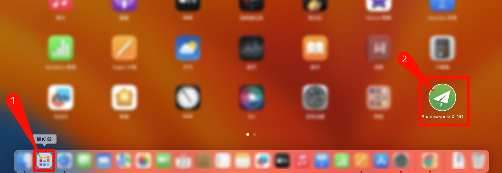
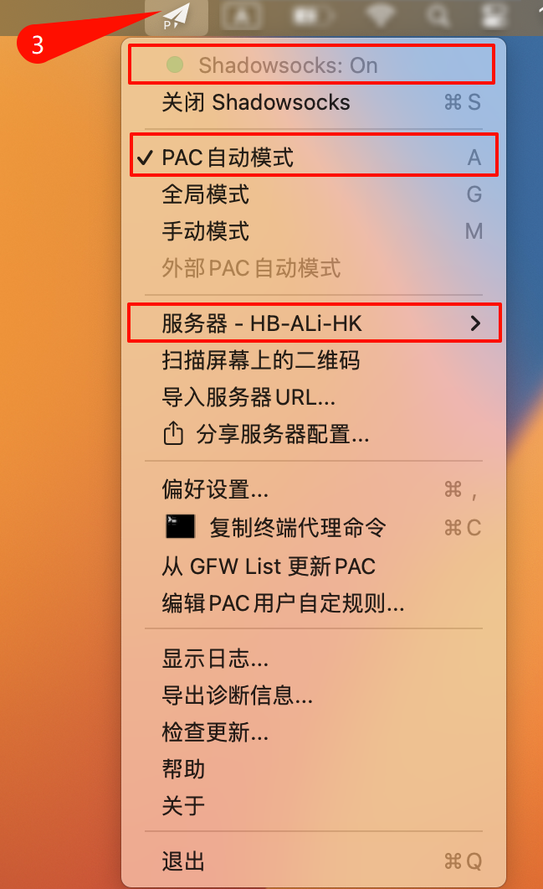
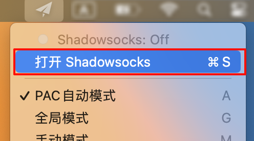
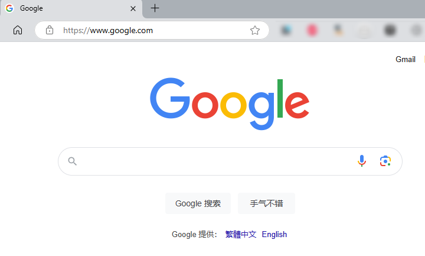
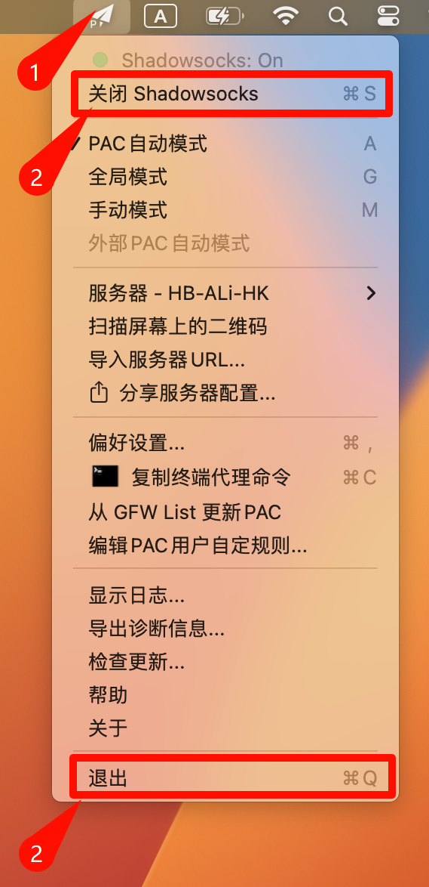
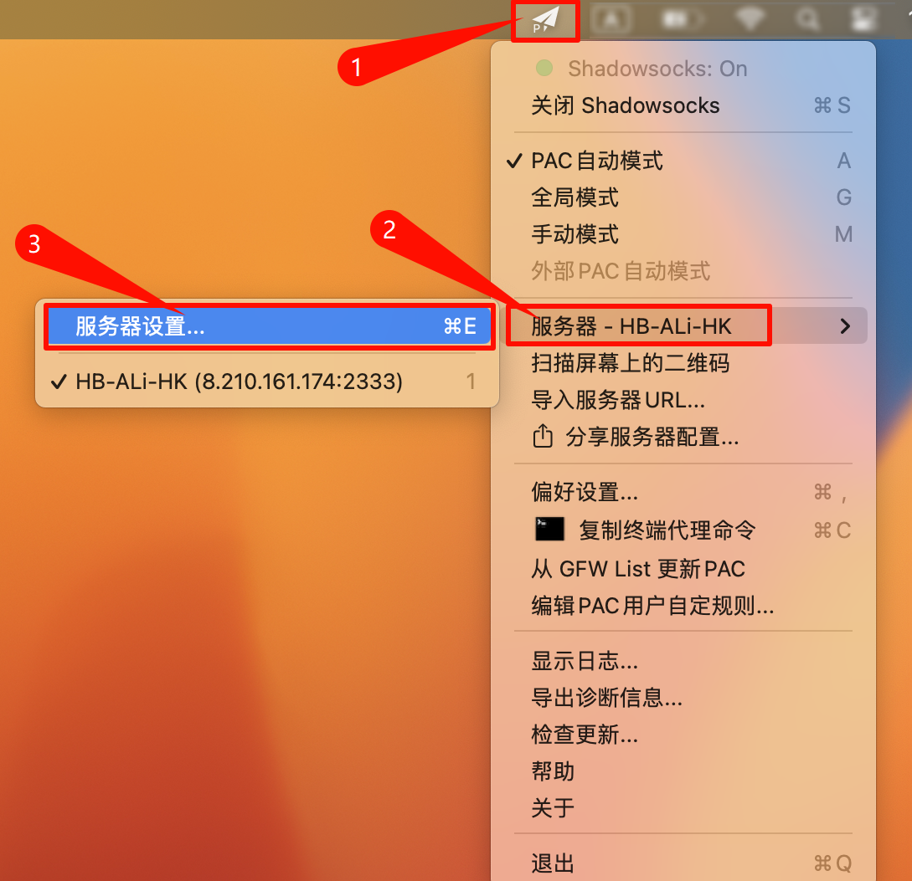
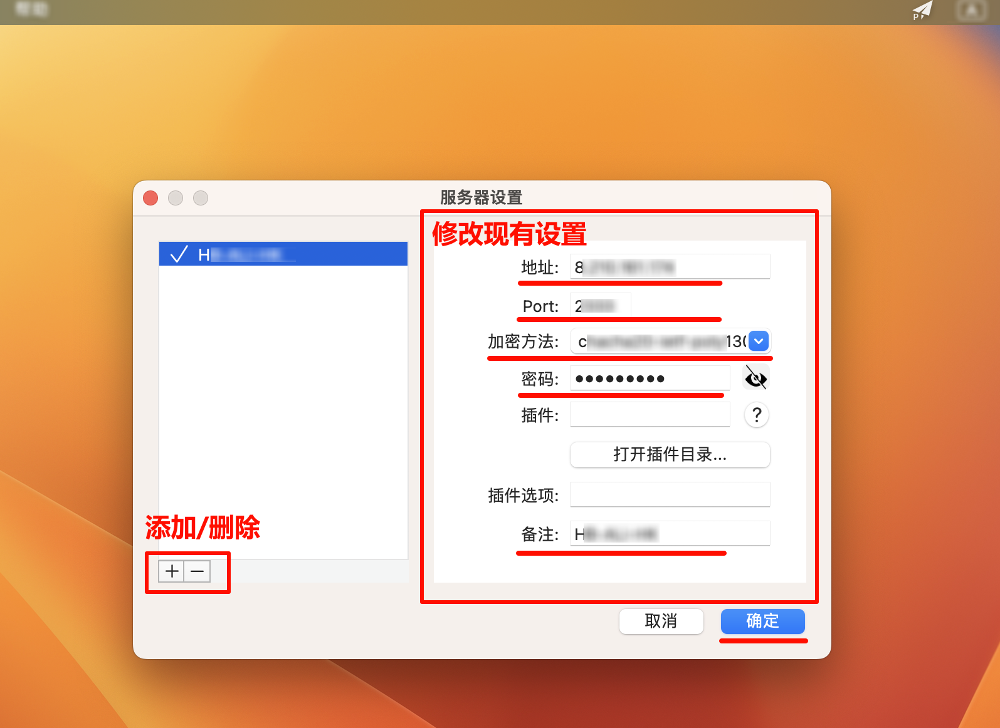

# Mac电脑之ShadowsocksX-NG使用说明

## 启动 ShadowsocksX-NG

**1）安装并配置完成后，在启动台中找到程序`ShadowsocksX-NG`并点击；** 
 

>   首次配置或修改配置请参见后文的 [配置 ShadowsocksX-NG](#peizhi) 

**2）在屏幕顶部菜单栏中，点击`小飞机`图标，查看下拉菜单：** 

-   确保`Shadowsocks:On`、勾选`PAC自动模式`、已选择`服务器` 

       

-   若`Shadowsocks:Off`，选择`打开Shadowsocks`即可

     

**3）浏览器访问[google](https://www.google.com)，若成功访问，则说明软件启动成功。** 

 

## 关闭 ShadowsocksX-NG

**在屏幕顶部菜单栏中，点击`小飞机`图标，在下拉菜单中选择`关闭Shadowsocks`或`退出`** 

 

## 配置 ShadowsocksX-NG 

**1）在屏幕顶部菜单栏中，点击`小飞机`图标，在下拉菜单中选择`服务器设置`**

 

**2）在打开的 服务器设置 窗口中，根据服务器信息，修改或添加服务器：** 

 

设置完成后，点击`确定`即可

# 软件下载地址

**注意：须在公司内网环境访问** 

-   【ShadowsocksX-NG】

    <a>http://192.168.110.130/soft/VPN/Mac/ShadowsocksX-NG.dmg</a> 

-   【Telegram】

    <a>http://192.168.110.130/soft/VPN/Mac/Telegram.dmg</a> 

