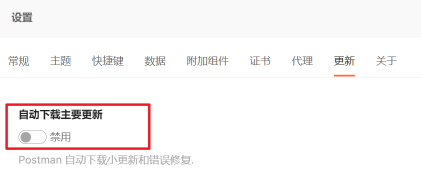
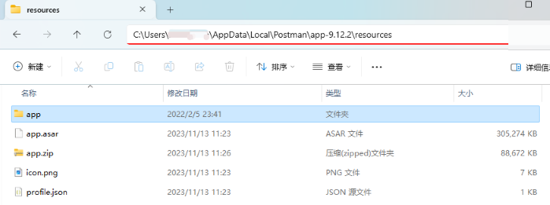
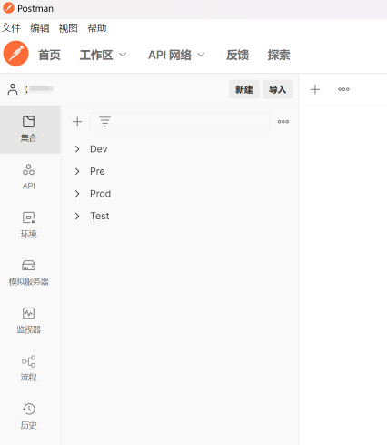

Postman本身不支持中文，需要另外下载非官方汉化包。

**汉化包地址**：https://github.com/hlmd/Postman-cn （Latest 9.12.2，on Feb 6, 2022）

**Postman软件包**：由于汉化包需与Postman软件本体的版本一致，所以Postman[下载 9.12.2](https://dl.filehorse.com/win/developer-tools/postman/Postman-win64-9.12.2-Setup.exe?st=K-b7qiOAGmPjvbIZ9TdCag&e=1699930273&fn=Postman-win64-9.12.2-Setup.exe) 版本

>   Postman老版本下载：https://www.filehorse.com/download-postman/old-versions/
>
>   -   PS：通过地址 `https://dl.pstmn.io/download/version/版本号/win64` 来下载老版本的方式已失效。

-   **特别注意：安装Postman后，确保禁用自动更新** 
    
     

---

下面以windows系统版本为例，来进行安装演示。

其他系统版本及详细步骤参考汉化包说明文档 https://github.com/hlmd/Postman-cn。

### 1）下载并安装 Postman

[下载 9.12.2 版本Postman](https://dl.filehorse.com/win/developer-tools/postman/Postman-win64-9.12.2-Setup.exe?st=K-b7qiOAGmPjvbIZ9TdCag&e=1699930273&fn=Postman-win64-9.12.2-Setup.exe) 软件包。

下载后点击安装即可。

### 2）下载并安装 汉化包

1.   **下载对应版本的 汉化包** [**app.zip**](https://github.com/hlmd/Postman-cn/releases) （[9.12.2版本](https://github.com/hlmd/Postman-cn/releases/tag/9.12.2)）

2.   将`app.zip`解压到Postman安装路径下的 `app-*.*.*/resources` 目录
      

3.   最后重启Postman就完成了。

      

